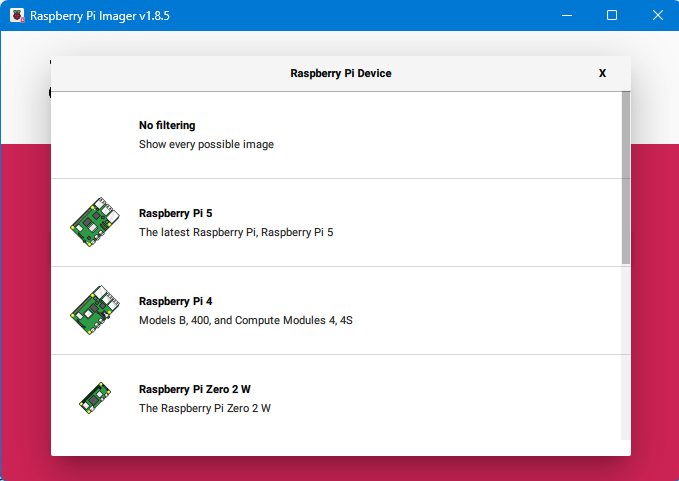
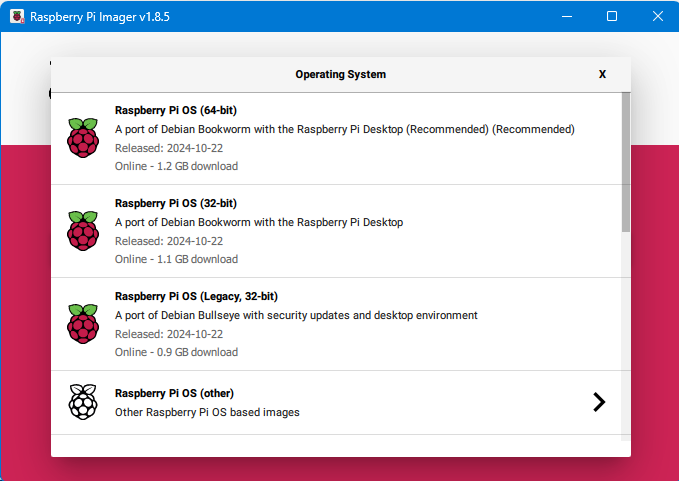
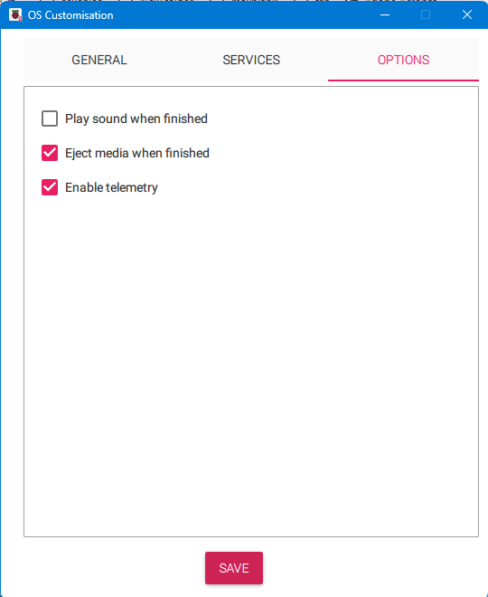

Getting started with RPI
========================

This document describes the essential steps students have to follow to
boot the Raspberry Pi with a Linux-based distribution such as Raspberry
PI OS. After performing the operating system installation, the student
must investigate the software tools installed and their potential.
Finally, the student must implement a software application that measures
3D acceleration using a transducer. The following variants of
application are proposed to the student:

1. Develop a simple console program developed in the C language.

2. (Optional) Develop an equivalent application using Python.

.. note::

    **[Time to complete the laboratory]:** The time necessary to complete steps 1 to 3 in this tutorial is approximately 4 hours. 

Reference Documentation
-----------------------

The following documentation has to be read and checked.

1. http://www.raspberrypi.org/help/. This web contains some guides and
   documents covering a lot of topics

2. https://projects.raspberrypi.org/en . RPI application examples

3. http://www.python.org. Phyton resources, tutorial, and reference

4. https://www.raspberrypi.org/courses/learn-python

5. http://i2c.info/i2c-bus-specification

Operating System Installation
-----------------------------

Downloading and installing Raspberry PI OS 
^^^^^^^^^^^^^^^^^^^^^^^^^^^^^^^^^^^^^^^^^^

Several Linux and Android distributions can be installed on the
Raspberry Pi platform. These Operating System distributions also include
multiple software applications and tools such as text editors, music
players, video editing and playing, games, development tools, etc.

Follow the steps below to install the Raspbian Operating System:

1) Download Raspberry Pi Imager tool from
   https://www.raspberrypi.org/software/

2) Execute the Raspberry PI Imager 
   (https://downloads.raspberrypi.org/imager/imager_latest.exe , see :numref:`imagermain`). First choose
   the Raspberry PI hardware and then, choose the Operating System (CHOOSE
   OS) and Storage options (CHOOSE STORAGE) to burn an SD card with the
   Raspberry PI OS 32 bits version. Click on the NEXT button and you
   will have the options to apply your specific customization (**enable
   SSH**, Username (rpi-student) and Password (rpi) , WIFI SSID and passkey, and your
   keyboard language configuration). Save the configuration and continue to write
   the micro SD Card.

.. figure:: rpi/media/imagermain.png
   :name: imagermain
   :width: 10cm
   :height: 8cm
   :align: center

   Raspberry Pi Imager main screen

   Raspberry Pi Imager HW model
   

   Raspberry Pi Imager OS selection

.. figure:: rpi/media/imagersettings.png
   :name: imagersettings
   :width: 10cm
   :height: 6cm
   :align: center

   Raspberry Pi Imager Settings

.. figure:: rpi/media/imagergeneral.png
   :name: imagergeneral
   :width: 8cm
   :height: 6cm
   :align: center

   Raspberry Pi Imager General Settings
   
.. figure:: rpi/media/imagerservices.png
   :name: imagerservices
   :width: 8cm
   :height: 6cm
   :align: center

   Raspberry Pi Imager OS Services

   Raspberry Pi Imager OS Options

Fig. : Menu with settings options. Enable the SSH connection and
configure the WIFI (see
https://www.raspberrypi.com/documentation/computers/getting-started.html#install-using-imager
for details)

.. warning::

   **[VERY IMPORTANT]:** Be careful in the destination device    where the image is burned because this information is not    recoverable 

3) Wait until the program ends writing the SD Card **(this can take up
   to one hour depending on your SD card category and model)**.

Setting up the Raspberry Pi
^^^^^^^^^^^^^^^^^^^^^^^^^^^

We need to interact with the Raspberry Pi for the activities described
in this document. There are three ways to establish this interaction:

-  The easiest one is connecting an HDMI monitor, a USB keyboard, and a
   USB mouse. This configuration allows us to use the Raspberry Pi as we
   would with a regular computer. Once the RPI is booted, we can set the
   WiFi connections and other settings such as enable the use of a
   serial line.

-  Opening an SSH session between your computer and the Raspberry Pi
   without connecting additional peripherals. This kind of configuration
   is known as headless start (use the `rpi-student` login).

-  Use the serial USB-TTL cable that you need to connect to the GPIO
   expansion connector. This **requires first to enable the serial line in
   the Raspberry PI OS using the raspi-config** tool
   (https://www.raspberrypi.com/documentation/computers/configuration.html#list-of-options).
   The connection of the USB -TTL cable is depicted in Fig. 4.

Fig. : Detail of expansion connector highlighting the USB-TTL RS232
connection

.. note..

   **[VERY IMPORTANT]:** In the UPM lab, there is no option to  connect the RPI to the ethernet cabled network; only a      
   dedicated WIFI (with no internet connection) is available  (SSID: RPI)

Reviewing the SD card content 
^^^^^^^^^^^^^^^^^^^^^^^^^^^^^

1) Plug in the SD card into the computer.

2) You should now see one new drive in the System Explorer (Windows)
   named "boot". In Linux you will see two partitions mounted in your
   system. Open the partition/unit identified as "boot".

.. note::

     **[VERY IMPORTANT]:** This is the partition used by          Raspberry to make the necessary hardware configuration before starting the operating system. Beware of not    deleting or modifying files other than those described in this  manual, or the Raspberry may not boot.  

3) List the content of the boot partition (FAT32) and identify the files
   as in Fig. 4 (Windows) or Fig. 5 (Ubuntu Linux).

Fig. : List of some of files in boot partition

Fig. : Content of boot partition

Booting the RPI
^^^^^^^^^^^^^^^

Insert the SD card and connect the power supply and all other cables
needed. The first time you boot your RPI you will see how the RPI is
configured (this information is only displayed in the HDMI monitor) and
rebooted. Wait 1 or 2 minutes (this depends again on your SD card
category) until the RPI is completely booted.

.. note::

    **[Security]:** Having the default user and password supposes  a security issue, more if the SSH sessions are enabled. You    can always change the password by executing the command passwd once logged in.  

Discovering the RPI IP address
^^^^^^^^^^^^^^^^^^^^^^^^^^^^^^

To open an SSH session from your computer to the Raspberry Pi you need
to know it's IP address. There are multiple ways to discover the
Raspberry Pi IP address:

a) If you know your Raspberry Pi MAC address, you can set the DHCP
   server to assign a static IP to the Raspberry Pi Mac. This is
   typically done in the router configuration. Please, consider that
   Ethernet and WiFi ports have different MAC addresses. In the
   laboratory, your Raspberry can have only a dynamically assigned IP in
   the WIFI network with SSID RPI (ask your instructor to verify the
   configuration). You can now insert the SD card in the Raspberry Pi
   and power it on.

b) You could open an RS232 serial connection in the Raspberry Pi GPIO
   ports and use the command line (ifconfig command) to obtain the IP or
   set the desired IP and netmask.

c) Use an IP Scanner utility
   (https://www.softperfect.com/products/networkscanner/), and scan in
   the range of your network. For example, you can quickly identify a
   Raspberry Pi as they use the hostname "raspberrypi.local" by default.
   This tool cannot be used at the UPM lab.

Connecting to the Raspberry-Pi using SSH and a graphical X client
^^^^^^^^^^^^^^^^^^^^^^^^^^^^^^^^^^^^^^^^^^^^^^^^^^^^^^^^^^^^^^^^^

Once we enabled the SSH session and determined the IP of our Raspberry,
we can establish the connection using the SSH protocol. We can establish
a remote connection with a graphical interface using the X-Window
protocol. For instance, we can use a client-server protocol where the PC
is the client, and the server is Raspberry Pi. The Raspberry PI OS
distribution includes the X Windows server. Therefore, you only need to
install a PC client application. This will allow us to handle the
Raspberry Pi remotely, viewing the Raspberry PI OS graphics interface.
Many PC Client X windows software tools are available on the internet.
In this document we explain the use of MobaXterm.

Using MobaXterm Software
~~~~~~~~~~~~~~~~~~~~~~~~

This software application is downloadable from
http://mobaxterm.mobatek.net/download-home-edition.html. Download and
install it. Configure a new session, writing the Raspberry-Pi IP
address. In Advanced Settings, select LXDE desktop in the Remote
environment (see Fig. 3) to establish the graphic interface mode
session.

Fig. MobaXterm settings for remote connection with Raspberry Pi

Open the session you just created, and you will be requested to type the
password.

.. note::

    **[Optional]:** Working with a terminal is most of the time    faster than working with a graphical interface, and it will   also free the Raspberry CPU from the load of the OS GUI. Once | used with the Linux terminal commands, you can set your       remote environment as "Interactive shell". Then, in case you  run any application with a GUI, such as nautilus (the file explorer) or firefox, a window with the GUI of the program    will be opened.                                               |

Now you are ready to start working with your Raspberry Pi OS. You can
open the Programs bar in the bottom left corner of the screen (see Fig.
4).

Fig. Program menu location in Raspberry Pi OS with remote LXDE desktop

Spend some minutes inspecting the Raspberry Pi OS environment. Also,
open the LX Terminal and get used to the Linux terminal commands. One
useful command is raspi-config. It allows us to set up different
Raspberry Pi configurations. Inspect the various menus and options but
do not change anything by the moment.

Raspberry Pi OS Update
^^^^^^^^^^^^^^^^^^^^^^

You can update and upgrade the OS if you have an internet connection.
Please, do not update the OS during the classes, as this operation will
require some time. You can update the OS by running the following
commands:

.. code-block:: bash

    $ sudo apt update
    $ sudo apt upgrade
    
    

integration of a 3-axis accelerometer with Raspberry-Pi 
-------------------------------------------------------

Specifications
^^^^^^^^^^^^^^

The student must investigate functions and commands and implement a C
program to get the following requirements:

1. Show the values of the 3-axis acceleration obtained from the MPU-6000
   I2C sensor.

2. The measurement readings are shown every 3 seconds.

Suggested Improvements
^^^^^^^^^^^^^^^^^^^^^^

-  Analyses the problem of offsets in the values returned. Define and
   implement a method to get corrected values

-  Get stop the program if "CRTL-C" is typed.

All improvements added by students will be taken into account.

Optional: Python Script
^^^^^^^^^^^^^^^^^^^^^^^

For advanced students, the implementation of this exercise in Python is
proposed. For this, you can use any of the multiple Python modules that
gain access to I2C interface in the Raspberry Pi.

Compiling & linking C program in Linux
-----------------------------------------------

In Linux, C/c++ programs are compiled and linked using the "make"
command. This command searches a "Makefile". A "Makefile" is a text file
with the necessary information to compile and link and must be in the
same directory of "*myprogram.c"*. The result will be *myprogram.o* and
*myprogram* (executable).

::

   DEBUG= -O2 #Debugging Level

   CC= gcc #Compiler command
   INCLUDE= -I/usr/local/include #Include directory
   CFLAGS= $(DEBUG) -Wall $(INCLUDE) -Winline #Compiler Flags
   LDFLAGS= -L/usr/local/lib #Linker Flags

   LIBS= -lpthread -lm #Libraries used if needed

   SRC = tcs34725.c

   OBJ 	= $(SRC:.c=.o)
   BIN 	= $(SRC:.c=)

   $(BIN):	 $(OBJ)
   	@echo [link] $@
   	$(CC) -o $@ $< $(LDFLAGS) $(LIBS)
   .c.o:
   	@echo [Compile] $<
   	$(CC) -c $(CFLAGS) $< -o $@

   clean:
   	@rm -f $(OBJ) $(BIN)

Fig. : Detail of source code of Makefile highlighting the “tabs” instead
of spaces

Questions to be reported to instructors
-------------------------------------------------

1. Explain the content of the config.txt file in your RPI

2. How the I2C interface is enabled? Is there any change in the
   config.txt file

3. Could you describe the commands used to compile a C/C++ program in
   Linux?

4. What is a library? What is the difference between a static and a
   dynamic library?

5. Summarize the utility of the makefile file and the make command.

6. What is the preferred utility to debug a C program in Linux?

7. How can you obtain the serial number of your Raspberry Pi? Is there
   any relation between the serial number and the MAC address?

