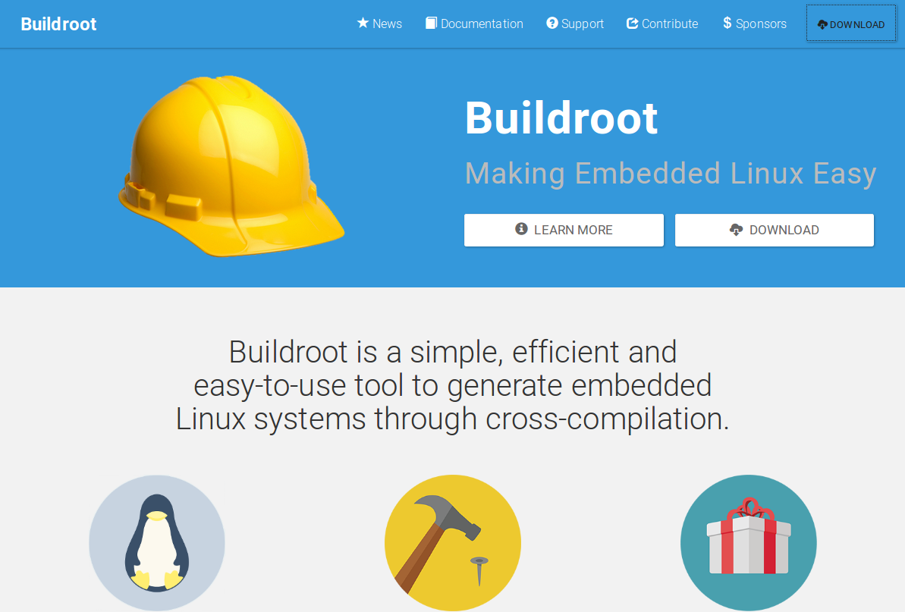
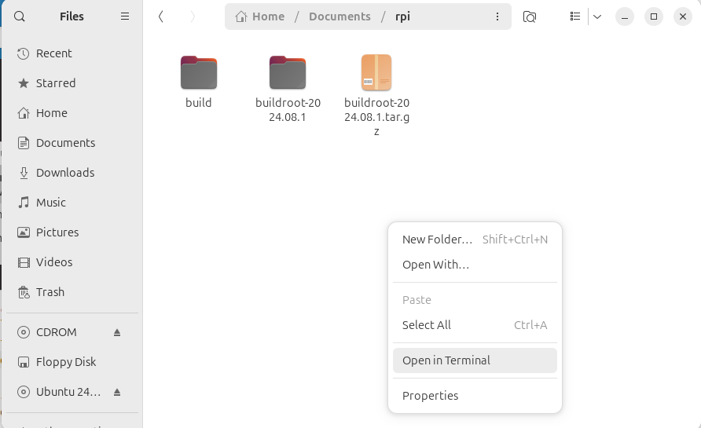

.. image:: rpi/media/image1.jpeg

|image1|\ Embedded Linux Systems: Using Buildroot for building Embedded
Linux Systems on Raspberry Pi 4 and 3 Model B by Mariano Ruiz is licensed
under a `Creative Commons Attribution-ShareAlike 4.0 International
License <http://creativecommons.org/licenses/by-sa/4.0/>`__.

.. |image1| image:: rpi/media/image2.png
   :width: 0.91667in
   :height: 0.32292in

Embedded Linux With RPI
=======================

Document Overview
-----------------

This document describes the steps to develop an embedded Linux-based
system using the Raspberry PI board. The document has been specifically
written to use a Raspberry PI development system based on the BCM2837
processor. All the software elements used have a GPL license.

.. note:: 
   The time necessary to  complete all the tutorial steps is approximately 8 hours.    

Read all the instructions carefully before executing the practical part;
Otherwise, you will find errors, which are probably unpredicted. In
parallel, you need to review the slides available at the Moodle site or
at [RD1]

References
----------

1. Embedded Linux system development. `Slides <https://moodle.upm.es/titulaciones/oficiales/course/view.php?id=1969>`_

2. https://bootlin.com/training/embedded-linux/

3. Mastering Embedded Linux Programming - Second Edition. Packt.
   https://www.packtpub.com/product/mastering-embedded-linux-programming-second-edition/9781787283282

4. Raspberry-Pi User Guide. Reference Manual.

   `www.myraspberry-pi.org/wp-content/.../Raspberry.Pi_.User_.Guide_.pdf‎ <http://www.myraspberry-pi.org/wp-content/.../Raspberry.Pi_.User_.Guide_.pdf‎>`__

Building Linux using buildroot
------------------------------

Elements needed for the execution of these LABS
^^^^^^^^^^^^^^^^^^^^^^^^^^^^^^^^^^^^^^^^^^^^^^^

In order to execute this lab properly, you need the following elements:

1. The VMware player software version 17.6.1 or above. Available at
   `Broadcom website <https://support.broadcom.com/group/ecx/productdownloads?subfamily=VMware+Workstation+Pro>`__ (free download and use but you need to register).
   This software has already been installed on the laboratory desktop
   computer.

2. A VMWare virtual machine with Ubuntu 24.04 and all the software
   packages installed is already available on the Desktop. This virtual
   machine is available for your personal use. If you want to set up
   your virtual machine by yourself, follow the instructions provided in
   `Annex I <#_annex_i:_Ubuntu>`__.

3. A Raspberry Pi, accessories and a USB cable are available at the
   laboratory.

4. Basic knowledge of Linux commands.

Starting the VMware
-------------------

Start VMware Player and open the RPI Virtual Machine. Wait until the
welcome screen is displayed (see :numref:`vmplayer` and :numref:`vmplayer-ubuntu`). Login as
“\ *ubuntu”* user using the password “ubuntu”.

.. figure:: rpi/media/image4.png
   :name: vmplayer
   :width: 10cm
   :height: 8cm
   :align: center

   Main screen of VMware player with some VM available to be executed
    
    
.. figure:: rpi/media/image5.png
   :name: vmplayer-ubuntu
   :width: 15cm
   :height: 10cm
   :align: center
   
   Ubuntu Virtual Machine login screen.

Open the **Firefox** web browser and download from
https://buildroot.org/, the version identified as **buidlroot2024-08-1**
(use the download link, see :numref:`webbuildroot`, and navigate searching for earlier
releases if necessary, https://buildroot.org/downloads/ ). Save the file
to the **Documents** folder in your account (:numref:`download`).

   
   Buildroot home page.

Buildroot is a tool to generate embedded Linux systems in our PC, and
then this Linux will be installed in the target.

.. figure:: rpi/media/buildrootdownload.png
   :name: download
   :width: 10cm
   :height: 7cm
   :align: center
   
   Example of Downloading Buildroot source code.

Create a folder “rpi” in “Documents”. Copy the file to the
“Documents/rpi” folder and decompress the file (:numref:`docfolder`).

.. figure:: rpi/media/documentsfolder.png
   :name: docfolder
   :width: 6.69375in
   :height: 1.5in
   :align: center
   
   Buildroot folder (the folder name depends on the version downloaded).

Right-click in the window and execute “Open in Terminal” or execute the
Terminal application from Dash home as shown in :numref:`terminal` (if “Open in
Terminal” is not available, search how to install it in Ubuntu).

   
   Terminal application

In some seconds, a command window is displayed. Then, execute these
commands:

.. code-block:: bash 

    $ mkdir build
    $ cd build
    $ make O=$PWD -C /home/ubuntu/Documents/rpi/buildroot-2024.08.1/ menuconfig

.. important::
    
    For this course, you will need to become familiar with the Linux Terminal use. On the Moodle site of this course, you can find a cheat sheet with the basic Linux commands. 

.. tip::
    
    In a Linux terminal, the “TAB” key helps you to  autocomplete the commands, folders, and file names. 

In some seconds, you will see a new window similar to :numref:`buildrootsetup`.

.. figure:: rpi/media/image10.png
   :name: buildrootsetup
   :width: 6.69375in
   :height: 3.20208in
   :align: center
   
   Buildroot setup screen.

Configuring Buildroot for RPI4
------------------------------

Once the **Buildroot** configuration is started, it is necessary to
configure the different items. You need to navigate the different menus
and select the installation elements. Table I contains the specific
configuration of **Buildroot** for installing it in the Raspberry Pi.
Depending on the downloaded version, the organization and the items
displayed can differ. If an item of buildroot configuration does not
appear in the Table I leaves it with its default value.

.. important::

    The Buildroot configuration is an iterative process. In order to set up your embedded Linux system, you  will need to execute the configuration several times. 
    
.. warning::

   The tables have three colums. Check that you understnad all the content shown.

Target Options
^^^^^^^^^^^^^^
This is the  selection of the processor to use (:numref:`target-options`).

.. list-table:: Target Options
   :name: target-options

   * - Target Architecture
     - AArch64 (little endian) 
     - ARM 64 bits
   * - Target Architecture Variants.
     - Cortex-A72
     - 
   * - Floating Point Strategy
     - VFPv4
     - 
   * - MMU  Page Size
     - 4KB
     -
   * - Target Binary Format
     - ELF
     - 

Toolchain
^^^^^^^^^
Cross Compiler, linker, and libraries to be  built to compile our embedded application. Select the options shown in the following table (:numref:`toolchain`). 

.. list-table:: Toolchain
   :name: toolchain
   :widths: 5 5 5
   
   * - Toolchain type
     - Buildroot toolchain
     - The Embedded Linux System will be compiled with tools integrated  into Buildroot
   * - Custom toolchain vendor name.
     - buildroot
     -
   * - C library
     - glib
     - Library    containing the typical C  libraries used in  Linux    environments   (stdlib, stdio,   etc)
   * - Kernel Header Options
     - 6.6.x kernel headers
     - 
   * - Binutils Version
     - 2.41
     - Binutils contains  tools to manage    the binary files obtained in the   compilation of   the different     applications    
   * - GCC  compiler Version
     - gcc 13.x   
     - GCC tools version to be installed  
   * - Enable C++ support
     - Yes. 
     - Including support for C++ programming, compiling, and    linking. 
   * - Build cross gdb for the host
     - Yes. 
     - Includes the  support for GDB.  
   * - Add Python support 
     - 
     -
   * - GDB debugger version
     - gdb 14.x
     -

Build options
^^^^^^^^^^^^^
How Buidlroot will build the code. Leave the default values.

System Configuration 
^^^^^^^^^^^^^^^^^^^^
Here you can define the basic configuration of the embedded Linux to generate and specific scripts to add additional functionality ( :numref:`sysconf`).

.. list-table:: System-configuration
   :name: sysconf

   * - Root FS skeleton
     - Default target skeleton. 
     - Linux folder filesystem organization for skeleton the embedded system 
   * - System hostname
     - **buildroot**   
     - Name of the embedded system
   * - System Banner
     - **Linux RPI 4**
     - Banner.
   * - Passwords encoding
     - sha 256 
     -
   * - Init System
     - Busybox
     -
   * - /dev management
     - Dynamic using devtmpfs + mdev
     - 
   * - Path to permissions for table  
     - **system/device_table.txt**  
     -
   * - Enable root login with password
     - yes
     - 
   * - Root password 
     - rpi
     -
   * - Busybox’ default shell 
     -  /bin/sh
     -
   * - Run a getty after boot
     - tty PORT: **console**. Baudrate: keep kernel default. TERM environment variable: vt100
     - 
   * - remount root filesystem read write during boot
     - Yes
     -
   * - Network interface to configure through DHCP
     - eth0
     -
   * - Set the system's default PATH
     - /bin:/sbin:/usr/bin:/usr/sbin  
     -
   * - Purge unwanted locales
     - yes
     -
   * - Leave the default values for all others
     - 
     -
   * - Custom scripts to run path **before** creatating filesystem images
     - **your path**/buildroot-2024.08.1/board/raspberrypi4-64/post-build.sh 
     -
   * - Custom scripts to run inside the fakeroot environment 
     - 
     -
   * - Custom scripts to run **after** creating filesystem images
     - **your path**/buildroot-2024.08.1/board/raspberrypi4-64/post-image.sh 
     -                                                        

Linux Kernel
^^^^^^^^^^^^

This is the configuration of the Linux kernel. The specific location and version is specified among other parameters (:numref:`kernel`). See thrird column for details of git repor to use.

.. list-table:: kernel-configuration
    :name: kernel
    
    * - Kernel Version
      - Custom tarball. 
      - $(call github,raspberrypi,linux,576cc10e1ed50a9eacffc7a05c796051d7343ea4)/linux-576cc10e1ed50a9eacffc7a05c796051d7343ea4.tar.gz  
    * - Kernel configuration 
      - Using and intree defconfig file
      -
    * - Defconfigname
      - bcm2711
      - This file contains the specific configuration of the kernel for the RPI
    * - Kernel binary format
      - Image 
      -
    * - Kernel  compression format
      - gzip compression
      -
    * - Build aDevice Tree Blob (DTB)
      - Yes
      -
    * - Intree Device Tree Source file name 
      - broadcom/bcm2711-rpi-4-b broadcom/bcm2711-rpi-400 broadcom/bcm2711-rpi-cm4 broadcom/bcm2711-rpi-cm4s
      - 
    * - Need host OpenSSL 
      - Yes
      -
    * - Linux kernel Extensions
      - Nothing
      - 
    * -  Linux Kernel Tools 
      - Nothing
      - 
	  
Target Packages
^^^^^^^^^^^^^^^

Target packages option allows to select the software elements that will be installed in the filesystem of the embedded Linux. Additionaly, this option install the busybox package that contains the basic Linux commands (:numref:`busybox`). Buildroot creates the filesystem hierarchy following the Linux standard organization.

.. list-table:: Busybox and target packages	
        :name: busybox
        
	* - Busybox
	  - yes
	  - 
	* - Busybox configuration file to use
	  - package/busybox/busybox.config
	  - 
	* - Show packages that are also provided by busybox
	  - Yes
	  -
	* - Audio and video applications
	  - Default values
	  - 
	* - Compresssors and decompressors
	  - xz-utils
	  - 
	* - Debugging, profiling and benchmark
	  - **gdb, gdbserver, full debugger** 
	  - 
	* - Developments tools
	  - Default values
	  -  
	* - Filesystem  and flash utilities 
	  - Default values
	  - 
	* - Games
	  - Default values 
	  - 
	* - Graphic libraries and applications (graphic/text) 
	  - Default values 
	  - 
	* - Hardware handling 
	  - **Firmware>rpifirmware** **rpi4 (default)**	
	  - Path to a file stores as boot/config.txt: **your path**/board/raspberrypi4-64/config_4_64bit.txt
	* - Hardware handling 
	  - **Firmware>rpifirmware**	  
	  - Path to a file stored as boot/cmdline.txt: **your path**/board/raspberrypi4-64/cmdline.txt
	* - Hardware handling 
	  - **Firmware>rpifirmware** 
	  - **install DTB  overlays**
	* - Interpreters language and  scripting Libraries 
	  - Python3
	  - 
	* - Miscellaneous
	  - Default Values
	  -
	* - Libraries
	  - Default Values	
	  - 
	* - Networking applications 
	  - **ifupdown scripts**, **openssh**
	  - 
	* - Package Managers
	  - Default values
	  - 
	* - Real Time, Shell and  utilities
	  - Default Values
	  -  
	* - System Tools
	  - kmod, kmod utilities
	  - 
	* - Text Editor and Viewers
	  - Default Values
	  - 

File System Images
^^^^^^^^^^^^^^^^^^

This option selects the format of the root filesystem and the size (:numref:`filesystemimage`).

.. list-table:: Filesystem images
    :name: filesystemimage

    * - ext2/3/4 root filesystem 
      - ext4
      -
    * - filesystem label
      - rootfs
      -
    * - exact size 
      - **400M** Leave the other default values
      - Update this value with your specific needs
    * - Compression method 
      - No compression
      - 
    
Boot-loaders
^^^^^^^^^^^^

The Raspberry PI does not need an specific bootloader becuase it is incorporated in the firmware provided by Broadcom.

      
Host Utilities
^^^^^^^^^^^^^^      
Additional tools needed for ubuntu to create all the embedded images (:numref:`hostutils`).

.. list-table:: Host utilities	
    :name: hostutils

    * - host environment setup
      - Yes
      -
    * - host genimage
      - Yes
      -
    * - host dosfstools
      - Yes
      -
    * - host kmod
      - Yes, support **xz-compressed modules**
      - 
    * - host mtools
      - Yes
      -

Once you have configured all the menus, you need to exit, saving the
values (File->Quit).

Compiling buildroot
-------------------

In the Terminal Window executes the following command (:numref:`buildbuildroot`):

.. code-block:: bash
   :caption: Build Buildroot
   :name: buildbuildroot

    $ make O=$PWD -C /home/ubuntu/Documents/rpi/buildroot-2024.08.1/ 

If everything is correct, you will see a final window similar to the one
represented in :numref:`buildrootok`.

.. warning::

    In this step, buildroot will connect, using the internet, to different repositories. After downloading the code, Buildroot will compile the applications and generate a lot of files and folders. Depending on your internet speed access and the   configuration chosen, this step could take up to **one hour  and a half**. If you have errors in the buildroot configuration,  you could obtain errors in this compilation phase. Check your configuration correctly. Use “make O=$PWD -C /home/ubuntu/Documents/rpi/buildroot-2024.08.1/ clean” to clean up  your partial compilation.

.. note::

    `dl` subfolder in your buildroot folder contains all  the packages downloaded for the internet. If you want to  move your buildroot configuration from one computer to another, avoiding the copy of the virtual machine, you can copy this folder.                                            |

.. warning::

   If your building process fails different reasons could be the origin. consider to use the following actions. Make a copy of your `.config` file (hidden file in Linux) to save your configuration.
   
   .. list-table:: actions
   
       * - make O=$PWD -C /home/ubuntu/Documents/rpi/buildroot-2024.08.1/ clean
         - Build again buildroot
       * - make O=$PWD -C /home/ubuntu/Documents/rpi/buildroot-2024.08.1/ distclean
         - configure and build again buildroot
   
   

.. figure:: rpi/media/buildrootok.png
   :width: 6.68125in
   :height: 4.46389in
   :name: buildrootok
   :align: center

   Successful compilation and installation of Buildroot

**Buildroot** has generated some folders with different files and
subfolders containing the tools for generating your Embedded Linux
System. The next paragraph explains the main outputs obtained,

Buildroot Output.
-----------------

The main output files of the execution of the previous steps can be
located in the folder “build/images”. :numref:`operations` summarizes the use of
**Buildroot**. Buildroot generates a bootloader, a kernel image, and a
file system.

.. figure:: rpi/media/buildroot.png
   :alt: Buildroot tool basic operation
   :width: 5.98081in
   :height: 2.5in
   :name: operations
   :align: center

   Schematic representation of the Buildroot tool. Buildroot generates the root file system, the kernel image, the bootloader, and
   the toolchain. Figure copied from “Bootlin” training materials
   (`http://bootlin.com/training/ <http://bootlins.com/training/>`__)

In our specific case, the folder content is shown in :numref:`outbuidlroot`

.. figure:: rpi/media/buildimages.png
   :width: 5.98081in
   :height: 4.0in
   :name: outbuidlroot
   :align: center

   The images folder contains the binary files for our embedded system.

Copy the `sdcard.img` file to your SDcard using this Linux command in the
Buildroot folder (`sdb` is typically the device assigned to the sdcard,
unless you have other removable devices connected to the system):

.. code-block:: bash

   $ sudo dd if=./images/sdcard.img of=/dev/sd<x> bs=10M 
   
.. warning::   
   <x> is the identification used by Linux for your microSD card,
   tipically “b” or “c”.  **Never** use “a” because this is the operating system hardisk

Remember to format again the microSDcard if you need to repeat this process otherwise you will have errors when Linux in booting.

.. seealso::
    
    Linux `gparted` is an excellent tool for partitioning and formatting the SD card.

Booting the Raspberry Pi.
-------------------------

:numref:`rpi4b` displays a Raspberry Pi. The description of this card, its
functionalities, interfaces, and connectors are explained in the ref
[RD2]. The fundamental connection requires:

a) To connect a USB to RS232 adapter (provided) to the raspberry-pi
   expansion header (see  :numref:`conn`, and :numref:`fdti`). This adapter provides the
   serial line interface as a console in the Linux host operating
   system.

b) To connect the power supply with the micro-USB connector provided (5
   v).

c) To connect the Ethernet cable to the RJ45 port if it is available
   (at home, not the case of UPM's Lab).

.. figure:: rpi/media/rpi4b.png
   :width: 7.0cm
   :height: 5.0cm
   :name: rpi4b
   :align: center
   
   RaspBerry-Pi 4 Model B hardware with main elements identified

.. figure:: rpi/media/rpiconnector.png
   :width: 3.0cm
   :height: 10.0cm
   :name: conn
   :align: center

   Raspberry-PI 4 header terminal identification.

.. figure:: rpi/media/fdticable.png
   :width: 5cm
   :height: 10.0cm
   :align: center
   :name: fdti
   
   Identification of the terminals in the USB-RS232 adapter
   
   
.. list-table:: FDTI Terminals
    :widths: 25 25
    :header-rows: 1
    :align: center
    
    * - RPI connector
      - FDTI Terminal
    * - RXD UART (GPIO16) Pin 10
      - Terminal 5 (Yellow)
    * - TXD UART (GPIO15) Pin 8
      - Terminal 4 (Orange)
    * - Ground (GND) Pin 6
      - Pin 1

The booting process of the Raspberry Pi BCM2711 `BCM2711 <https://www.raspberrypi.com/documentation/computers/processors.html#bcm2711>`_ processor is depicted
in :numref:`RPIBoot`. Take into account that this System On Chip (SoC), the
BCM2711, contains two different processors: a :term:`GPU` and an ARM
CPU. The programs *bootcode.bin* and *start.elf* are written
explicitly for the GPU, and the source code is unavailable. Broadcom
only provides details of this to customers who sign a commercial
agreement. The last executable (*start.elf*) boots the ARM processor and
allows the execution of ARM programs such as Linux OS kernel or other
binaries such as u-boot bootloader.

.. figure:: rpi/media/bcm2711boting.png
   :alt: RPI booting process
   :width: 4.90093in
   :height: 4.28723in
   :name: RPIBoot
   :align: center

   Booting process for BCM2711 processor in the raspberry-pi.

The config.txt file contains essential information to boot the Linux OS
and perform the configuration of different hardware elements (look at
http://elinux.org/RPiconfig and check the meaning of the different
configuration parameters). Verify the content of the config.txt file
generated by buildroot and complete it as depicted below ( :numref:`aa` ).

.. code-block:: bash
    :caption: config.txt file
    :name: aa
   
    # Please note that this is only a sample, we recommend you to change it to fit
    # your needs.# You should override this file using BR2_PACKAGE_RPI_FIRMWARE_CONFIG_FILE.
    # See http://buildroot.org/manual.html#rootfs-custom
    # and http://elinux.org/RPiconfig for a description of config.txt syntax
    
    start_file=start4.elf
    fixup_file=fixup4.dat
    
    kernel=**Image**
    
    # To use an external initramfs file
    #initramfs rootfs.cpio.gz
    # Disable overscan assuming the display supports displaying the full resolution
    # If the text shown on the screen disappears off the edge, comment this out
    
    disable_overscan=1
    
    # How much memory in MB to assign to the GPU on Pi models having
    # 256, 512 or 1024 MB total memory
    gpu_mem_256=100
    gpu_mem_512=100
    gpu_mem_1024=100
    
    # Enable UART0 for serial console on ttyAMA0
    dtoverlay=miniuart-bt
    
    # enable autoprobing of Bluetooth driver without need of hciattach/btattach
    dtparam=krnbt=on	

In this example, once the ARM is released from reset, it executes the
Image application. This binary application is the Linux Kernel in Image
format. The parameters passed to the application specified in the
`kernel=<….>` are detailed in the `cmdline.txt` file. For instance, by
default, Buildroot generates this one (:numref:`cmdline`):

.. code-block:: bash
    :caption: cmdline.txt file
    :name: cmdline
    
    root=/dev/mmcblk0p2 rootwait console=tty1 console=ttyAMA0,115200

In the Linux machine, open a Terminal and execute the program `sudo putty` with
**sudo rights** (sudo putty), in a second a window appears. Configure the
parameters using the information displayed in :numref:`putty` (for the specific
case of `putty`), and then press “Open”. **Apply the power to the
Raspberry PI,** and you will see the booting messages.

.. tip::
    **[Serial interface identification in Linux]:** In Linux the  serial devices are identified typically with the names       /dev/ttyS0, /dev/ttyS1, etc. In the figure, the example has   been checked with a serial port implemented with a USB-RS232 converter. This is the reason why the name is **/dev/ttyUSB0**.   In your computer, you need to find the identification of   your serial port. Use Linux **dmesg** command to do this.    

.. figure:: rpi/media/image19.png
   :alt: Putty serial line
   :width: 4.90093in
   :height: 4.28723in
   :name: putty
   :align: center

   Putty program main window.

After a few seconds, you will see a lot of messages displayed on the
terminal. Linux kernel is booting, and the operating system is running
its configuration and initial daemons. If the system boots correctly,
you will see an output like the one represented in :numref:`linuxboot`. Introduce
the username *root* (password in case you have configured it), and the Linux shell will be available for you.

.. figure:: rpi/media/image20.png
   :width: 6.69514in
   :height: 2.58472in
   :name: linuxboot
   :align: center
   
   Linux Running in the RaspBerry Pi

.. tip::

    **[DHCP Server]:** The DHCP server providing the IP address  to the RPI should be active in your network. In the UPM ETSIST labs, there is no cabled network, only WIFI. If you are using the RPI at home, the DHCP server is running in your router. The method used to assing IP addresses is different from one manufactures to others. If you want to know the IP address assigned, you have two options: use a serial cable connected to the RPI (`ifconfig` command) or check the router status web page and display the table of the DHCP clients connected. Looking for the MAC in the list, you will obtain the IP address.         

Connecting the RPI to the cabled ethernet network
-------------------------------------------------

Inspecting the configuration of the network interface generated automatically by Buildroot
^^^^^^^^^^^^^^^^^^^^^^^^^^^^^^^^^^^^^^^^^^^^^^^^^^^^^^^^^^^^^^^^^^^^^^^^^^^^^^^^^^^^^^^^^^

Inspect the content of `/etc/network/interfaces` and `/etc/init.d/S40network`. You will see content similar to this in the
`interfaces` file:

.. code-block:: bash

   # interface file auto-generated by buildroot

   auto lo
   iface lo inet loopback

   auto eth0
   iface eth0 inet dhcp
   	pre-up /etc/network/nfs_check
   	wait-delay 15
   	hostname $(hostname)

This configuration activates the use of eth0 with DHCP support. Test the
connectivity, trying to connect to another computer in the laboratory.
Use the ping command.

.. note::

    **[Help]:** If you run the ping command in the Raspberry   trying to connect with a computer in the laboratory, you      probably obtain a connection timeout. Consider that   computers running Windows could have the firewall activated. You can also try to run the ping on a windows computer or on Linux virtual machine. In this case, the RPI does not have a  firewall running, and the connection should be successful.   

.. admonition:: Question

    What is the MAC address of your RPI interface? Use the `dmesg` command to see the kernel boot parameters and identify the method used to get the MAC address from the hardware. 

Adding WIFI support 
-------------------

Adding mdev support to Embedded Linux
^^^^^^^^^^^^^^^^^^^^^^^^^^^^^^^^^^^^^

The folder <buildroot-folder>\ */package/busybox* contains two files
named S10mdev and mdev.conf. These files have to be added to the target
filesystem. This step is done by adding these commands to the
*<buildroot-folder>/board/raspberrypi4-64/post-build.sh* script:

.. code-block:: bash

   cp <buildroot-folder>/package/busybox/S10mdev ${TARGET_DIR}/etc/init.d/S10mdev
   chmod 755 ${TARGET_DIR}/etc/init.d/S10mdev
   cp <buildroot-folder>/package/busybox/mdev.conf ${TARGET_DIR}/etc/mdev.conf

.. note::

    [mdev] mdev provides a method to add or remove hotplug devices in Linux.  

Adding the Broadcom firmware support for Wireless hardware
^^^^^^^^^^^^^^^^^^^^^^^^^^^^^^^^^^^^^^^^^^^^^^^^^^^^^^^^^^

The hardware element included in the RPI-3 for the Wireless
communication is implemented with the BCM43438 chip. It is needed to
include the software packages with the firmware’s chip and the wireless
utilities.

1. Execute “make ……. menuconfig”. Navigate to “Target Packages->Hardware
   Handling->Firmware-> bcrmfmac-sdio-firmware-rpi” and select the
   “bcrmfmac-sdio-firmware-rpi-wifi”.

2. Before compiling Buildroot we need to add more software supporting
   the configuration of the WIFI.

   a. Navigate to “Target Packages->Networking Applications” and select

      -  “crda”

      -  “ifupdown scripts”

      -  “iw”

      -  “wireless-regdb”

      -  “wireless tools”

      -  “wpa_supplicant”

         1. “Enable EAP”

         2. “Enable WPS”

         3. “Install wpa_cli binary”

         4. “Install wpa_client shared library”

         5. “Instal wpa_passphrase binary”

   b. Add these lines to ./board/rapsberrypi3-64/post-build.sh.

.. code-block:: bash

   cp <buildroot-folder>/board/raspberrypi4-64/interfaces ${TARGET_DIR}/etc/network/interfaces
   cp <buildroot-folder>/board/raspberrypi4-64/wpa_supplicant.conf ${TARGET_DIR}/etc/wpa_supplicant.conf

c. Create the file `*<buildroot-folder>*/board/raspberrypi4-64/interfaces`
   with the highlighted content:

.. code-block:: bash
   :emphasize-lines: 10,11,12,13,14
   
   auto lo
   iface lo inet loopback

   auto eth0
   iface eth0 inet dhcp
   	pre-up /etc/network/nfs_check
   	wait-delay 15
   	hostname $(hostname)

   auto wlan0
   iface wlan0 inet dhcp
          pre-up wpa_supplicant -B -iwlan0 -c/etc/wpa_supplicant.conf
          post-down killall -q wpa_supplicant
          wait-delay 15

d. Create the file
   `*<buildroot-folder>*/board/raspberrypi4-64/wpa_supplicant.conf` with this
   content (ask professors about the values to be provided as SSID and
   Key-passwd). You can define as many WIFIs as you want.

.. code-block:: bash

   network={
       ssid="SSID"
       key_mgmt=WPA-PSK
       psk="PASSWORD"
       priority=9
   }

3. Perform a `*make*` and burn again the new image in the micro SDcard. Boot the
   Raspberry and check that you can connect to the wireless network.
   
   
Customizing the Linux kernel
----------------------------

Kernel configuration
^^^^^^^^^^^^^^^^^^^^

Execute the following command to configure the Linux Kernel in Buildroot

.. code-block:: bash
   
   $ make  O=$PWD -C /home/ubuntu/Documents/rpi/buildroot-2024.08.1/ linux-menuconfig
   
Using the different menus you can configure specific kernel features, add support for specific device drivers and multiple additional functionalities. The compilation of the Linux kernel package is done with this command:

.. code-block:: bash
   
   $ make  O=$PWD -C /home/ubuntu/Documents/rpi/buildroot-2024.08.1/ linux-rebuild

In order to get the new sdcard.img file execute:

 .. code-block:: bash
   
   $ make  O=$PWD -C /home/ubuntu/Documents/rpi/buildroot-2024.08.1/  
